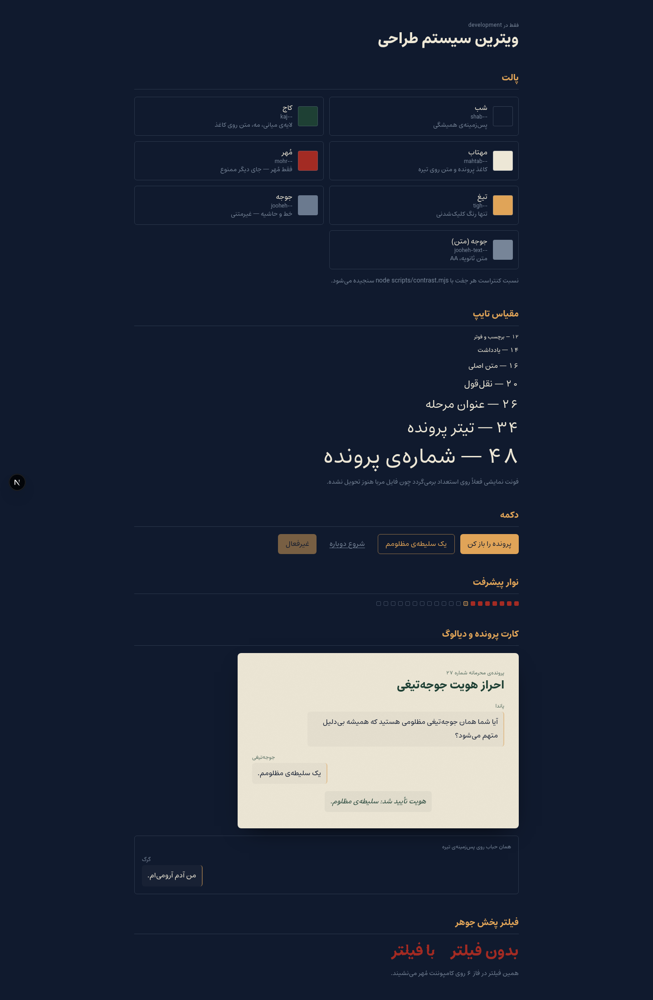
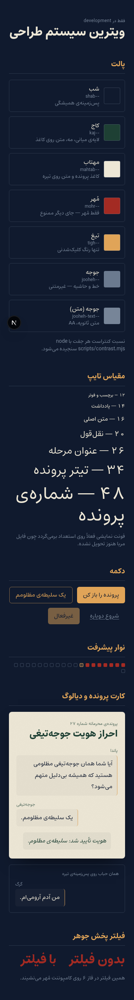

# فاز ۱ — سیستم طراحی

**وضعیت:** بسته ✅
**پذیرش:** هیچ رنگ hex ای خارج از `app/globals.css` وجود ندارد؛ همه‌ی جفت‌های رنگی حد خودشان را پاس می‌کنند.

---

## ۱. پالت

همه‌ی رنگ‌ها به‌صورت `@theme` در `app/globals.css` تعریف شده‌اند و Tailwind از رویشان utility می‌سازد (`bg-shab`، `text-tigh`، `border-jooheh`، …).

| توکن                  | کد        | نقش                            | قاعده                                                                            |
| --------------------- | --------- | ------------------------------ | -------------------------------------------------------------------------------- |
| `--color-shab`        | `#101A2E` | پس‌زمینه‌ی شب جنگل             | همیشه پس‌زمینه. هیچ استثنایی.                                                    |
| `--color-kaj`         | `#1E4034` | لایه‌ی میانی، مه، متن روی کاغذ | عنوان‌های روی کارت مهتابی از این می‌آید.                                         |
| `--color-mahtab`      | `#EDE7D6` | کاغذ پرونده، متن روی تیره      | کارت پرونده همیشه این رنگ است.                                                   |
| `--color-mohr`        | `#A32B23` | قرمز مُهر                      | **فقط روی مُهر و نوار پیشرفت.** هرجای دیگر برود اثرش می‌میرد.                    |
| `--color-tigh`        | `#E0A458` | کهربایی تیغ                    | **تنها رنگ کلیک‌شدنی.** هر چیزی که این رنگ را دارد باید قابل تعامل باشد و برعکس. |
| `--color-jooheh`      | `#6B7A8F` | خط، حاشیه، آیکون               | غیرمتنی. برای متن استفاده نشود — پایین ببین.                                     |
| `--color-jooheh-text` | `#778598` | متن ثانویه                     | تنها نسخه‌ی مجاز خاکستری‌آبی برای متن.                                           |

### چرا `--jooheh-text` اضافه شد

سند پالت `--jooheh` را «برای متن ثانویه و خطوط» تعریف کرده بود، ولی `#6B7A8F` روی `#101A2E` فقط **۳٫۹۷ به ۱** کنتراست دارد. این برای خط و عنصر گرافیکی کافی است (حد ۳) اما برای متن معمولی زیر حد AA است (حد ۴٫۵) — یعنی قاعده ۵ سند با خودِ پالت سند تناقض داشت.

به‌جای دست‌زدن به رنگ اعلام‌شده، همان رنگ ۸٪ روشن‌تر به‌عنوان یک توکن دوم اضافه شد: `#778598` با نسبت **۴٫۶۳**. تفاوت بصری‌شان با چشم تقریباً دیده نمی‌شود.

- `--color-jooheh` → `border-*`، خط جداکننده، آیکون تزئینی
- `--color-jooheh-text` → هر جا واقعاً متن است

اگر ترجیح می‌دهی خود `--jooheh` روشن شود و توکن دوم حذف، یک خط تغییر است.

## ۲. کنتراست — نتیجه‌ی سنجش

`node scripts/contrast.mjs` رنگ‌ها را مستقیم از `globals.css` می‌خواند، نسبت WCAG 2.1 را حساب می‌کند و اگر جفتی بیفتد با کد خطا تمام می‌شود.

| جفت                       | نسبت  | حد  | نتیجه |
| ------------------------- | ----- | --- | ----- |
| مهتاب روی شب              | ۱۴٫۰۶ | ۴٫۵ | ✅    |
| تیغ روی شب                | ۷٫۹۶  | ۴٫۵ | ✅    |
| جوجه روی شب (غیرمتنی)     | ۳٫۹۷  | ۳   | ✅    |
| جوجه‌ی متنی روی شب        | ۴٫۶۳  | ۴٫۵ | ✅    |
| شب روی مهتاب              | ۱۴٫۰۶ | ۴٫۵ | ✅    |
| کاج روی مهتاب             | ۹٫۲۵  | ۴٫۵ | ✅    |
| مُهر روی مهتاب (گرافیکی)  | ۵٫۸۱  | ۳   | ✅    |
| مهتاب روی کاج             | ۹٫۲۵  | ۴٫۵ | ✅    |
| شب روی تیغ (دکمه‌ی پرشده) | ۷٫۹۶  | ۴٫۵ | ✅    |

## ۳. تایپوگرافی

| نقش     | توکن             | فونت                             | استفاده                            |
| ------- | ---------------- | -------------------------------- | ---------------------------------- |
| نمایشی  | `--font-display` | مربا Bold → _فعلاً استعداد_      | تیتر پرونده، عنوان مرحله، متن مُهر |
| متن     | `--font-body`    | استعداد                          | دیالوگ، گزینه، توضیح               |
| کاربردی | `--font-ui`      | وزیرمتن، `letter-spacing: .04em` | شماره‌ی پرونده، برچسب، فوتر        |

مقیاس: `12 / 14 / 16 / 20 / 26 / 34 / 48` روی `text-xs` تا `text-3xl`.
اعداد با `font-variant-numeric: tabular-nums` روی `body` تا شماره‌ها نلرزند.

> فایل مربا هنوز تحویل نشده و `@font-face` آن در `globals.css` کامنت است. تا آن موقع تیترها استعداد سنگین‌اند — کار می‌کند ولی شخصیت نمایشی‌ای که سند می‌خواهد را ندارد. جزئیات در `public/fonts/README.md`.

## ۴. کامپوننت‌های پایه

| کامپوننت        | فایل                              | نکته                                                                                                                                                                  |
| --------------- | --------------------------------- | --------------------------------------------------------------------------------------------------------------------------------------------------------------------- |
| `Card`          | `components/ui/Card.tsx`          | کارت پرونده. `max-w-card` (۶۲۰px)، کاغذ مهتابی، بافت روی همه‌چیز.                                                                                                     |
| `Button`        | `components/ui/Button.tsx`        | سه حالت `solid` / `outline` / `quiet`. ارتفاع حداقل ۴۴px برای لمس موبایل. هیچ‌جا `outline: none`.                                                                     |
| `SpeakerBubble` | `components/ui/SpeakerBubble.tsx` | خط دیالوگ. `side` سمت گوینده را می‌دهد؛ در RTL راوی از راست وارد می‌شود. نام گوینده prop است، نه هاردکد (قاعده ۱).                                                    |
| `ProgressSeal`  | `components/ui/ProgressSeal.tsx`  | یک مُهر کوچک به‌ازای هر مرحله؛ تکمیل‌شده‌ها `--mohr` می‌گیرند. `role="progressbar"` با `aria-label` فارسی.                                                            |
| `PaperTexture`  | `components/ui/PaperTexture.tsx`  | نویز `feTurbulence`، `mix-blend-mode: multiply`، opacity پیش‌فرض ۰٫۰۸. **صفر بایت دانلود** — بدون فایل تصویری، بدون CDN.                                              |
| `InkBleedDefs`  | `components/motion/InkBleed.tsx`  | دو فیلتر SVG پخش جوهر (`ink-bleed` درشت برای مُهر، `ink-bleed-soft` برای قاب). یک بار در `layout.tsx` رندر می‌شود و هرجا با `filter: url(#ink-bleed)` صدا زده می‌شود. |

## ۵. ویترین

`/dev/kit` همه‌ی توکن‌ها و کامپوننت‌ها را کنار هم نشان می‌دهد. **در production با `notFound()` بسته می‌شود** — در build تولیدی این مسیر ۴۰۴ می‌دهد.

### دسکتاپ ۱۴۴۰px

### موبایل ۳۶۰px

هر دو بدون سرریز افقی رندر می‌شوند.

## ۶. قواعدی که از اینجا به بعد رعایت می‌شوند

1. **هیچ رنگ hex ای خارج از `globals.css`.** اگر رنگی لازم شد، اول توکن می‌شود.
   تنها استثنا `THEME_COLOR` در `lib/theme.ts` است: `<meta name="theme-color">` متغیر CSS قبول
   نمی‌کند چون مرورگر رنگ نوار آدرس را قبل از پارس شدن استایل‌شیت می‌خواهد. `scripts/contrast.mjs`
   چک می‌کند این مقدار از `--color-shab` جدا نیفتد، پس استثنا قابل فراموش‌شدن نیست.
2. **`--tigh` یعنی کلیک‌شدنی.** متن غیرتعاملی این رنگ را نمی‌گیرد و عنصر تعاملی بدون این رنگ نمی‌ماند.
3. **`--mohr` فقط مُهر.**
4. **`outline: none` ممنوع.** `:focus-visible` سراسری در `globals.css` تعریف شده.
5. **هدف لمسی حداقل ۴۴ پیکسل.**
6. **متن ثانویه از `--jooheh-text` می‌آید، نه `--jooheh`.**
