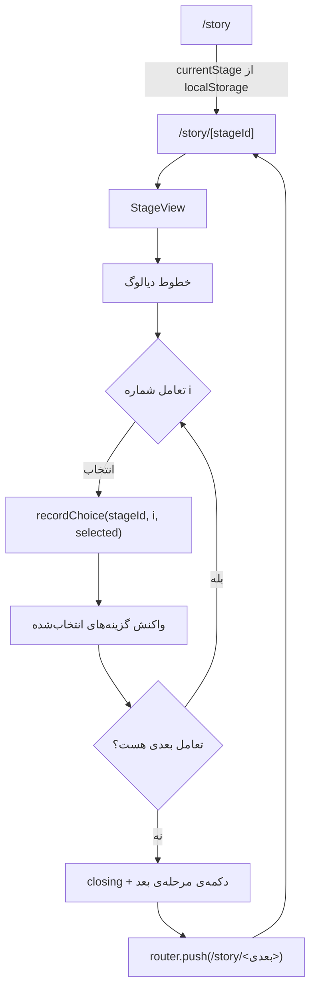
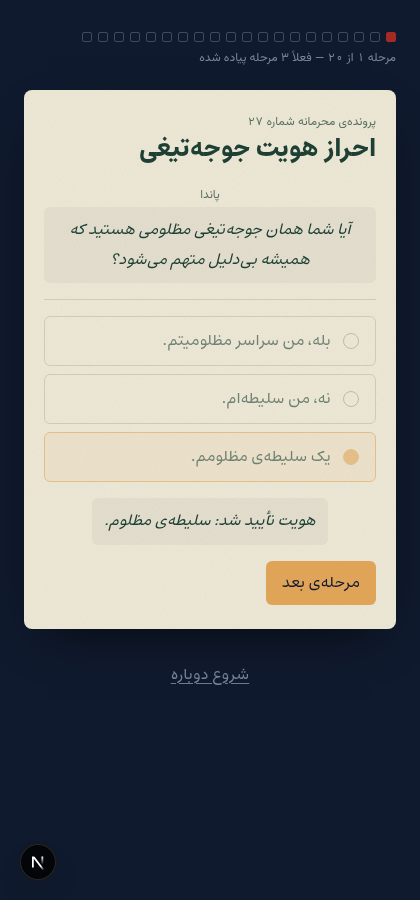
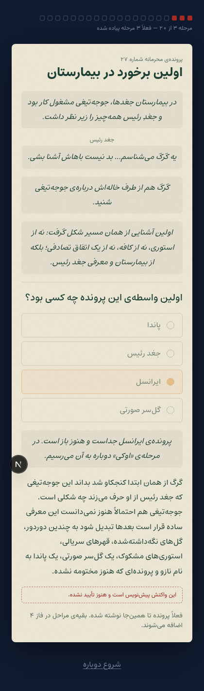

# فاز ۲ — موتور داستان

**وضعیت:** بسته ✅
**پذیرش:** با سه مرحله‌ی موجود می‌توان از ۱ تا ۳ رفت، رفرش کرد و در همان مرحله ماند. تأیید شده با اجرای مرورگر واقعی — بخش ۶.

---

## ۱. جریان



**قاعده ۳ در عمل:** `getNextStageId` فقط به جای مرحله در آرایه نگاه می‌کند، نه به انتخاب کاربر. هیچ گزینه‌ای مسیر را نمی‌بندد، هیچ‌کس به عقب برنمی‌گردد و هیچ ترکیبی بن‌بست نمی‌سازد. تفاوت گزینه‌ها فقط در متن واکنش است.

## ۲. شکل state

```ts
{
  currentStage: 's03',
  choices: { s01: ['salite-mazloom'], s02: ['oon-akhlagh'], s03: ['irancell'] },
  unlockedNodes: ['bimarestan'],
  soundOn: false,
}
```

- کلید `localStorage`: **`wolf-hedgehog-v1`**، با `version: 1` برای مهاجرت‌های بعدی.
- `choices[stageId][i]` انتخاب تعامل شماره‌ی `i` است. انتخاب چندتایی با «،» در همان خانه جمع می‌شود تا شکل state تخت بماند.
- `unlockedNodes` بعد از هر ثبت از روی `choices` **دوباره حساب می‌شود**، نه اینکه جداگانه نگه‌داری شود؛ پس نمی‌تواند از واقعیت جدا بیفتد.
- `soundOn` پیش‌فرض `false` است (فاز ۶).

**قاعده ۲:** این داده هیچ‌وقت جایی نمی‌رود. هیچ endpoint ای نمی‌گیردش، هیچ‌جا لاگ نمی‌شود. سرور حتی نمی‌داند کاربر کجای داستان است — به همین دلیل `/story` تصمیم ریدایرکت را سمت کلاینت می‌گیرد، نه در middleware.

## ۳. موتور — `lib/engine.ts`

همه‌ی توابع خالص‌اند و بدون مرورگر اجرا می‌شوند، تا اسکریپت تست مسیر فاز ۷ بتواند مستقیم صدایشان بزند.

| تابع                                       | کار                                                                                         |
| ------------------------------------------ | ------------------------------------------------------------------------------------------- |
| `getStage(id)`                             | مرحله یا `undefined`                                                                        |
| `getNextStageId` / `getPrevStageId`        | ناوبری ترتیبی                                                                               |
| `validateSelection(interaction, selected)` | فقط **شکل** انتخاب را می‌سنجد (تکی/چندتایی، حداقل و حداکثر). هیچ‌وقت نمی‌گوید جواب غلط است. |
| `reactionsFor(interaction, selected)`      | گزینه‌های انتخاب‌شده برای نمایش واکنش                                                       |
| `isStageComplete(stage, choices)`          | مرحله وقتی تمام است که برای هر تعاملش انتخابی ثبت شده باشد                                  |
| `unlockedNodesFor(choices)`                | نقاط نقشه‌ی روشن‌شده                                                                        |
| `progressFor(stageId, choices)`            | `{ current, done, total: 20, implemented }`                                                 |

`total` همیشه ۲۰ است حتی وقتی فقط ۳ مرحله پیاده شده، تا نوار پیشرفت طول واقعی پرونده را نشان بدهد؛ `implemented` تعداد مراحل موجود است.

## ۴. تغییرات اسکیما نسبت به سند

داستان تحویلی در اسکیمای بخش ۵ سند جا نمی‌شد. چهار تغییر لازم شد. هر چهار مورد فرض من‌اند و برگرداندنشان ساده است — `docs/OPEN-QUESTIONS.md` بند ۳.

| تغییر                                              | چرا                                                                                                                                                |
| -------------------------------------------------- | -------------------------------------------------------------------------------------------------------------------------------------------------- |
| `act: 1..9` به‌جای `1..5`                          | داستان ۹ فصل دارد.                                                                                                                                 |
| `interactions: Interaction[]` به‌جای `interaction` | مرحله ۲۰ دو تعامل پشت سر هم دارد: اول سفارش، بعد پاسخ نهایی.                                                                                       |
| `kind: 'repeat'` (جدید)                            | مرحله ۱۳ («نمی‌دونم») دکمه‌ای است که با هر کلیک جمله‌ی تازه‌ای می‌دهد و بعد از `threshold` بار پیام پایانی. هیچ `kind` موجودی این را پوشش نمی‌داد. |
| `split.rejections` (جدید)                          | مرحله ۱۹ برای هر کارت در کشوی اشتباه واکنش مشخص دارد.                                                                                              |

یک چیز هم به‌خاطر ابزار عوض شد: `choice` دو شکل دارد و هر دو `kind: 'choice'` هستند، پس zod اجازه نمی‌داد هر دو عضو مستقیم یک `discriminatedUnion` روی `kind` باشند. تفکیک داخلی روی `multi` انجام می‌شود و کل آن یک عضو بیرونی است. رفتار بیرونی فرقی نکرده.

### فیلد `draft`

`Option.draft?: true` یعنی آن واکنش پیش‌نویس من است و هنوز تأیید نشده. سه اثر دارد:

1. در UI زیر واکنش یک نوار قرمزِ «این واکنش پیش‌نویس است و هنوز تأیید نشده» می‌آید.
2. `pnpm validate:content` فهرستشان را چاپ می‌کند.
3. `pnpm validate:content:strict` با وجود هر پیش‌نویس با کد خطا تمام می‌شود — پس محتوای تأییدنشده نمی‌تواند بی‌سروصدا منتشر شود.

## ۵. افزودن مرحله‌ی جدید

۱. `content/stages/sNN.ts` را بساز و با `defineStage({...})` بنویس.
۲. در `content/index.ts` وارد `registry` کن. **ترتیب آرایه ترتیب داستان است.**
۳. اگر مرحله نقطه‌ی نقشه روشن می‌کند، `mapNode` را برابر یکی از شناسه‌های `content/map.ts` بگذار.
۴. `pnpm validate:content` بگیر.

اعتبارسنجی همان لحظه‌ی import انجام می‌شود، پس یک فایل خراب هم در `pnpm dev` و هم در `pnpm build` بلافاصله خطا می‌دهد.

`pnpm validate:content` چیزهایی را می‌گیرد که اسکیما نمی‌تواند: شناسه‌ی تکراری مرحله یا گزینه، نقطه‌ی نقشه‌ی ناموجود، گزینه‌ی بی‌واکنش، نقطه‌ای که هیچ مرحله‌ای روشنش نمی‌کند، و پیش‌نویس تأییدنشده.

اسکریپت‌ها فایل‌های `.ts` را مستقیم import می‌کنند — بدون build و بدون وابستگی اضافه. `scripts/ts-loader.mjs` فقط پسوند و `@/` را حل می‌کند؛ حذف تایپ‌ها کار خود Node است.

## ۶. نتیجه‌ی تست واقعی

با Chromium روی ۴۲۰×۹۰۰ اجرا شد:

```
s01 title: احراز هویت جوجه‌تیغی
  reaction visible: true
s02 title: معرفی گرگ
s03 title: اولین برخورد در بیمارستان
  draft badge visible: true
after reload url: /story/s03           ← رفرش، همان‌جا ماند
/story redirected to: /story/s03       ← بازگشت به مرحله‌ی ذخیره‌شده
localStorage: {"state":{"currentStage":"s03","choices":{...},"unlockedNodes":["bimarestan"],...}}
after reset url: /story/s01            ← شروع دوباره
after reset storage: choices خالی
external hosts contacted: none ✅       ← قاعده‌ی شبکه‌ی ایران
page errors: none ✅
```





## ۷. آنچه هنوز پیاده نشده

- تعامل‌های `sort`، `find`، `split` و `repeat` اسکیما و اعتبارسنجی دارند ولی هنوز کامپوننت ندارند؛ در جای خودشان یک جعبه‌ی خط‌چین «در فاز ۳ پیاده می‌شود» رندر می‌شود.
- انیمیشن‌ها فعلاً فقط ورود و خروج کارت‌اند (بخش ۴ سند). مُهر، مه، پین نقشه و بقیه در فاز ۶.
- مراحل ۴ تا ۲۰ در فاز ۴.
