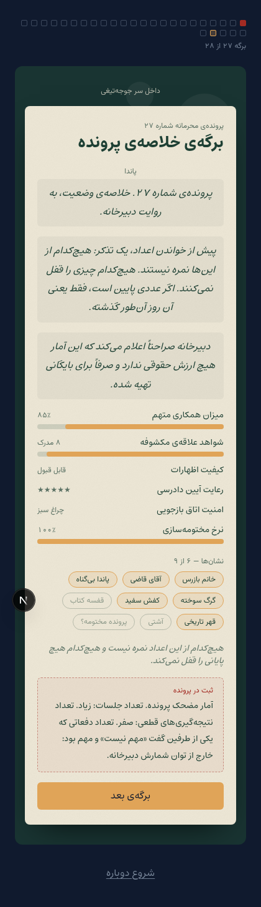
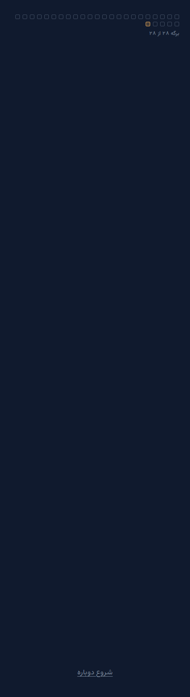

# فاز ۴ — محتوای ۲۸ برگه

**وضعیت:** کامل و قابل بازی از ابتدا تا انتها.
**پذیرش:** zod هر ۲۸ برگه را پاس می‌کند؛ عبور کامل `p00 → p27` در مرورگر بدون بن‌بست؛ هر ۹ نشان و هر ۱۵ گره نقشه در پایان باز می‌شوند.

---

## ۱. آنچه نوشته شد

سه چیز که `MERGED-SPEC` بخش ۱۰ باز گذاشته بود:

| مورد                          | وضعیت       |
| ----------------------------- | ----------- |
| گزینه‌های بازیکن برای ۲۶ برگه | ✅ نوشته شد |
| لایه‌ی پاندا برای هر ۲۸ برگه  | ✅ نوشته شد |
| دیالوگ برگه‌های ۲۶ و ۲۷       | ✅ نوشته شد |

**همه‌ی این متن‌ها نوشته‌ی من‌اند، نه تحویلی.** هر گزینه با `draft: true` علامت خورده (۷۵ مورد). سه اثر دارد: در UI نشان می‌خورد، `pnpm validate:content` فهرستشان می‌کند، و `pnpm validate:content:strict` تا تأیید نشدنشان با خطا تمام می‌شود.

دیالوگ‌هایی که در `STORY-28.md` نوشته شده بودند **عیناً** استفاده شده‌اند و پیش‌نویس حساب نمی‌شوند — مثل «من منم سننع»، «بغلت کردم، در مدت معلوم»، «کاش اژدها بودم» و متن راوی پایانی.

## ۲. نقشه‌ی برگه‌ها

| دفتر | برگه | عنوان               | اسکین         | تعامل           | نشان           |
| ---- | ---- | ------------------- | ------------- | --------------- | -------------- |
| ۱    | ۰۰   | تشکیل پرونده        | cover         | —               |                |
| ۱    | ۰۱   | آشنایی در بیمارستان | interrogation | choice          |                |
| ۱    | ۰۲   | اولین چت            | interrogation | choice          |                |
| ۱    | ۰۳   | جنگ لقب‌ها          | interrogation | pick            | خانم بازرس     |
| ۲    | ۰۴   | حادثه‌ی «اوکی»      | interrogation | choice          |                |
| ۲    | ۰۵   | دادگاه              | interrogation | choice          | آقای قاضی      |
| ۲    | ۰۶   | من منم              | mind          | —               |                |
| ۲    | ۰۷   | حادثه‌ی پاندا       | interrogation | choice          | پاندا بی‌گناه  |
| ۲    | ۰۸   | فهرست نزدیکان       | mind          | choice          |                |
| ۳    | ۰۹   | کل‌کل               | interrogation | choice          |                |
| ۳    | ۱۰   | هدیه و توجه         | interrogation | choice          |                |
| ۳    | ۱۱   | خانواده‌ی آینده     | interrogation | choice          |                |
| ۳    | ۱۲   | چت شبانه            | mind          | choice          |                |
| ۳    | ۱۳   | قرارداد بغل         | interrogation | **split**       |                |
| ۳    | ۱۴   | اژدها               | mind          | choice          | گرگ سوخته      |
| ۴    | ۱۵   | کفش سفید            | map           | **find**        | کفش سفید       |
| ۴    | ۱۶   | مجموعه کلاه         | interrogation | choice چندتایی  |                |
| ۴    | ۱۷   | حدس غذا             | interrogation | pick            |                |
| ۴    | ۱۸   | برنامه‌ی بیرون      | map           | pick            |                |
| ۴    | ۱۹   | مسئله‌ی رئیس        | interrogation | **split**       |                |
| ۵    | ۲۰   | سوءتفاهم بزرگ       | interrogation | choice          | قهر تاریخی     |
| ۵    | ۲۱   | ملکه                | interrogation | choice          |                |
| ۵    | ۲۲   | دادگاه دوم          | interrogation | choice          |                |
| ۵    | ۲۳   | شرط آشتی            | interrogation | choice          | قفسه کتاب      |
| ۶    | ۲۴   | ملاقات              | interrogation | choice ۴ رویکرد |                |
| ۶    | ۲۵   | ترمیم               | interrogation | choice          | آشتی           |
| ۶    | ۲۶   | برگه‌ی خلاصه        | mind          | نمایش شاخص‌ها   |                |
| ۶    | ۲۷   | فصل بعد             | ending        | ۴ پایان         | پرونده مختومه؟ |

## ۳. قواعدی که در نوشتن رعایت شد

از `MERGED-SPEC` و قوانین ۱ تا ۱۵ سند اصلی:

- **بازیکن گرگ است.** هر گزینه تصمیم گرگ است، نه توضیح بازیکن. هیچ برگه‌ای نمی‌پرسد «تو چه حسی داری».
- **شوخی به گرگ برمی‌گردد.** قانون ۸: گرگ نباید همیشه برنده نمایش داده شود.
- **هر دو اشتباه می‌کنند** (قانون ۹). برگه ۲۰ هر دو روایت را کنار هم ثبت می‌کند و هیچ‌کدام را غلط اعلام نمی‌کند.
- **هیچ گزینه‌ای غلط نیست.** بدترین حالت مُهر «مردود» یا «مشکوک» با یک جمله‌ی خنده‌دار است و بازیکن به برگه‌ی بعد می‌رود.
- **جوجه‌تیغی همیشه عصبانی نیست** (قانون ۷). حالت `storm` فقط در یک برگه (۲۳) استفاده شده.
- **جغد رئیس وارد جزئیات رابطه نمی‌شود** (قانون ۱۴). تنها دیالوگش در برگه ۱۹ این است که پرونده را به میزش راه نمی‌دهد.
- **ابی** فقط در برگه ۱۲ و بدون هیچ نظری حاضر است (قانون ۱۵).

## ۴. مواردی که سند خودش حذف کرده و پیاده نشد

طبق `MERGED-SPEC` بخش ۷: `PMS MODE`، شرط `Trust >= 80` و قفل `MARRIAGE PATH`، جمله‌ی «مسیر اصلی»، و جریمه‌ی `Wrong Guess -5`. برگه ۱۷ (حدس غذا) به همین دلیل از آزمون به شوخی تبدیل شد و هیچ حدسی غلط نیست.

**هیچ نام واقعی‌ای در هیچ فایلی نوشته نشد** — قاعده ۴ و تصمیم قفل‌شده‌ی `MERGED-SPEC` بخش ۱.

## ۵. شاخص‌ها و نشان‌ها

شش شاخص طنز روی چهارده برگه دلتا می‌گیرند. **موتور اصلاً نمی‌خواندشان.** تنها جایی که خوانده می‌شوند برگه ۲۶ است.

`applyStage` **دقیقاً یک بار به‌ازای هر برگه** اجرا می‌شود (`applied[]` در استور). اثر برگه موقع **رسیدن** به آن اعمال می‌شود، نه موقع رفتن به بعدی — وگرنه برگه ۲۷ که «بعدی» ندارد هیچ‌وقت نشان و گره‌ی نقشه‌ی خودش را نمی‌گرفت. این یک باگ واقعی بود که در تست عبور کامل پیدا شد.



## ۶. چهار پایان

`MERGED-SPEC` بخش ۵: هر چهار پایان **هم‌ارزش‌اند و همیشه در دسترس**. هیچ شاخصی هیچ‌کدام را قفل نمی‌کند و «مسیر اصلی» وجود ندارد. به همین دلیل هر چهار دکمه یک شکل رندر می‌شوند — هیچ‌کدام برجسته‌تر نیست — و بعد از دیدن هر پایان می‌شود به بقیه برگشت.



## ۷. نتیجه‌ی عبور کامل

```
برگه‌های طی‌شده: 28 → p00 p01 … p26 p27
ایست در /story/p27 — صفحه‌ی پایان‌ها ✅
نشان‌ها: 9/9 | گره‌های نقشه: 15/15
شاخص‌ها: {"ezharat":10,"hamkari":6,"dadresi":6,"mokhtome":9,"shavahed":8,"amniyat":8}
external hosts: none ✅
errors: none ✅
```

## ۸. آنچه هنوز نیست

- **اسکین‌های `ChatSkin`، `CourtSkin` و `SummarySkin`** ساخته نشدند. برگه‌های چت و دادگاه فعلاً روی `interrogation` می‌نشینند و برگه ۲۶ روی `mind`. محتوا کامل است؛ فقط فضای بصری اختصاصی ندارند.
- **حالت چهره‌ی هر گزینه** هنوز به محتوا وصل نیست. نُه حالت آماده است ولی `StageView` همیشه `neutral` می‌فرستد.
- **`kind: 'sort'` و `kind: 'repeat'`** در اسکیما هستند ولی هیچ برگه‌ای از آن‌ها استفاده نمی‌کند.
- تأیید تک‌تک ۷۵ پیش‌نویس.
