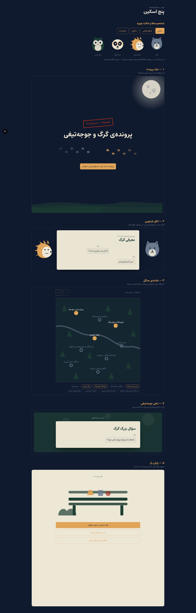
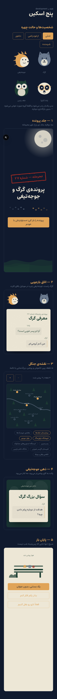

# فاز ۳ — پنج اسکین

**وضعیت:** بسته ✅
**پذیرش:** هر پنج اسکین در ۳۶۰px و ۱۴۴۰px بدون سرریز افقی رندر می‌شوند — اندازه‌گیری شده، نه چشمی: `document.documentElement.scrollWidth - clientWidth` در هر دو عرض **صفر** است.

---

## ۱. آرت‌ورک — چرا کامپوننت، نه فایل در `public/art`

سند گفته بود آرت‌ورک SVG در `public/art` باشد، و همان‌جا شرط گذاشته بود: «شخصیت‌ها با اجزای جدا (بدن / صورت / حالت) تا تعویض حالت بدون بارگذاری مجدد باشد.»

یک `` برای هر حالت یعنی چهار فایل و یک درخواست شبکه در لحظه‌ی تعویض حالت — دقیقاً همان چیزی که شرط منع کرده. پس آرت‌ورک به‌صورت کامپوننت SVG درون‌خطی در `components/art/` نوشته شد: بدن یک بار رندر می‌شود و فقط گروه `<g>` صورت با `AnimatePresence` عوض می‌شود. صفر درخواست، صفر بایت اضافه.

جانبی‌اش این است که SVG می‌تواند `var(--color-tigh)` بخواند، پس آرت‌ورک هم زیر همان قاعده‌ی «هیچ hex ای خارج از `globals.css`» می‌ماند. تنها استثنا `app/icon.svg` است که آیکون تب مرورگر است و پیش از بارگذاری استایل‌شیت لازم می‌شود.

| فایل                             | چه چیزی                                                                    |
| -------------------------------- | -------------------------------------------------------------------------- |
| `components/art/Wolf.tsx`        | گرگ، چهار حالت چهره                                                        |
| `components/art/Hedgehog.tsx`    | جوجه‌تیغی، چهار حالت چهره                                                  |
| `components/art/Panda.tsx`       | پاندا (نازو) با عینک بازپرسی؛ `onClick` اختیاری برای تخم‌مرغ عید پاک فاز ۶ |
| `components/art/Owl.tsx`         | جغد رئیس                                                                   |
| `components/art/Moon.tsx`        | ماه با هاله‌ی گرادیان                                                      |
| `components/art/ForestMap.tsx`   | نقشه با نه نقطه؛ مختصات از `content/map.ts` می‌آید                         |
| `components/motion/FogLayer.tsx` | مه دولایه، ۴۰ و ۶۵ ثانیه، جهت‌های مخالف                                    |

چهار حالت چهره: `neutral` / `smug` / `hurt` / `guilty` (`components/art/faces.ts`).

## ۲. پنج اسکین

| #   | کامپوننت            | چه کرد                                                                                                            |
| --- | ------------------- | ----------------------------------------------------------------------------------------------------------------- |
| ۱   | `CoverSkin`         | ماه، مه دولایه، دو ردپا که از دو طرف به وسط می‌رسند، مُهر «محرمانه — شماره ۲۷» با فرود اسکیل ۲٫۴ و فیلتر پخش جوهر |
| ۲   | `InterrogationSkin` | کارت مرکزی، **گرگ سمت راست، جوجه‌تیغی سمت چپ**؛ زیر `lg` هر دو بالای کارت می‌روند تا کارت تمام‌عرض بماند          |
| ۳   | `MapSkin`           | نقشه‌ی نه‌نقطه‌ای، پین خاموش/روشن، بزرگ‌نمایی، به‌علاوه‌ی فهرست متنی همان نقاط                                    |
| ۴   | `MindSkin`          | پس‌زمینه از شب به کاج می‌رود، مه کنار می‌رود، حباب‌های شناور با فاز تصادفی                                        |
| ۵   | `EndingSkin`        | صبح؛ تنها جای پروژه که پس‌زمینه `--mahtab` است. نیمکت، سفارش‌ها، بوته‌ای که پاندا پشتش است                        |

`SkinFrame` کارت را داخل اسکین درست می‌گذارد و انتخابش کاملاً از `stage.skin` می‌آید — عوض کردن فضای یک مرحله یک کلمه در فایل محتواست و هیچ کد UI ای دست نمی‌خورد.

### دو تصمیم که ارزش گفتن دارند

**سمت شخصیت‌ها.** در RTL اولین فرزند یک `flex` سمت **راست** می‌نشیند. اولین نسخه `<Hedgehog>` را اول گذاشته بود و نتیجه دقیقاً برعکس سند شد. حالا `<Wolf>` اول می‌آید. در اسکرین‌شات‌ها قابل بررسی است.

**بزرگ‌نمایی نقشه با دکمه، نه pinch.** سند «pan و zoom در موبایل» خواسته بود. pinch روی صفحه‌ی کوچک با اسکرول صفحه دعوا می‌کند و کاربر کیبوردی اصلاً راهی به آن ندارد. دو دکمه‌ی صریح با `aria-label` هر دو مشکل را ندارند؛ جابه‌جایی هم با کشیدن داخل قاب اسکرول‌شونده انجام می‌شود. علاوه بر آن، فهرست متنی نقاط زیر نقشه هست تا صفحه‌خوان و کاربر کیبورد بدون درگیر شدن با SVG بفهمند کدام نقطه روشن است.

## ۳. اسکرین‌شات

### دسکتاپ ۱۴۴۰px

### موبایل ۳۶۰px

`/dev/skins` این‌ها را کنار هم نشان می‌دهد و **در production با `notFound()` بسته می‌شود**.

## ۴. کاهش حرکت

هر انیمیشنی که در این فاز اضافه شد از `useReducedMotion` رد می‌شود:

- مه هر دو لایه ساکن می‌مانند.
- مُهر جلد بدون چرخش و بدون فیلتر جوهر ظاهر می‌شود.
- پین‌های نقشه بدون bounce و بدون دایره‌ی جوهر می‌آیند.
- حباب‌های ذهن شناور نمی‌شوند.
- تعویض حالت چهره یک fade کوتاه است.

## ۵. آنچه به فاز بعد ماند

- **حالت چهره هنوز به محتوا وصل نیست.** `SkinFrame` پراپ `wolfFace` و `hedgehogFace` می‌گیرد ولی `StageView` فعلاً `neutral` می‌فرستد. اینکه کدام گزینه کدام حالت را بیاورد تصمیم محتواست، نه UI؛ در فاز ۴ کنار متن‌ها می‌آید و در فاز ۶ به `AnimatePresence` وصل می‌شود. هر چهار حالت الان در `/dev/skins` قابل دیدن‌اند.
- **کامپوننت‌های `sort`، `find`، `split` و `repeat`** هنوز نوشته نشده‌اند؛ اسکیما و اعتبارسنجی دارند و در UI جای‌نگهدار خط‌چین می‌گیرند. اولین مرحله‌ای که واقعاً به آن‌ها نیاز دارد در فاز ۴ می‌آید.
- **مُهر انتخاب** (بخش ۳٫۳ سند) فقط روی جلد پیاده شده. کامپوننت `Stamp` عمومی با شیک ۳ پیکسلی در فاز ۶ است.
