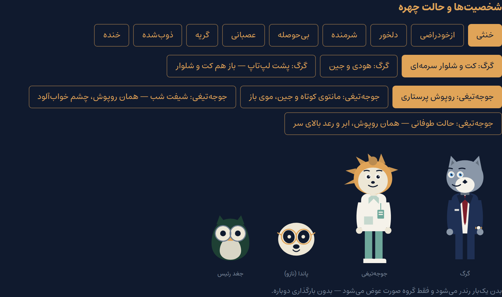

# راهنمای شخصیت

مرجع ظاهر، لباس و حالت هر شخصیت. هر تغییری در آرت‌ورک اول اینجا ثبت می‌شود.

> **قاعده ۴ سند:** «بدون نام و تصویر واقعی. فقط شخصیت‌های حیوانی.»
> در همه‌ی این پروژه — کد، محتوا و مستند — شخصیت‌ها فقط با نام حیوانی‌شان
> شناخته می‌شوند. هیچ نام واقعی‌ای در مخزن نوشته نمی‌شود.

---

## سبک بصری

هدف: **تصویرسازی برداری استوری‌بوک** — شخصیت حیوانی تمام‌قد با لباس واقعی،
سیلوئت گرد و دوستانه، چشم‌های بزرگ و حالت‌های اغراق‌شده که احساس را خوب منتقل
می‌کنند. نه کارتون کودکانه، نه واقع‌گرایانه.

**آنچه شدنی نیست و چرا:** ظاهر Disney/Pixar رندر سه‌بعدی است — نور واقعی، مو،
پخش زیرسطحی. با SVG دست‌ساز به آن نمی‌رسیم. آنچه از آن سبک قابل برداشت است و
اینجا اعمال شده، _طراحی شخصیت_ است: نسبت‌های اغراق‌شده، چشم بزرگ و بیانگر،
لباس واقعی روی بدن حیوانی، و رنگ‌های قوی. اگر ظاهر رندرشده لازم باشد، راهش
تصویر شطرنجی است که تصمیم self-host و بودجه‌ی حجم را عوض می‌کند — تصمیم جداست.

هر شخصیت یک کامپوننت SVG درون‌خطی است. بدن یک بار رندر می‌شود و فقط گروه صورت
عوض می‌شود، پس تعویض حالت هیچ درخواست شبکه‌ای ندارد.

---

## 🐺 گرگ

### ظاهر ثابت

گرگ خاکستری، قدبلند، **چشم آبی**، لبخند شیطنت‌آمیز، همیشه مرتب.
چشم آبی و لبخند شیطنت‌آمیز نشانه‌های ثابتش‌اند و در هیچ حالتی حذف نمی‌شوند.

### لباس

| حالت     | کِی                                 | چه چیزی                                                              |
| -------- | ----------------------------------- | -------------------------------------------------------------------- |
| `formal` | ۹۰٪ داستان                          | کت و شلوار سرمه‌ای، پیراهن سفید، کراوات زرشکی، ساعت کلاسیک، کفش رسمی |
| `casual` | دوردور، بستنی، قهوه، ماشین، قدم زدن | هودی یا تیشرت ساده، جین، کتانی سفید، همان ساعت                       |
| `desk`   | پشت لپ‌تاپ                          | باز هم کت و شلوار، به‌علاوه‌ی میز، لپ‌تاپ و قهوه                     |

`formal` شخصیتش را می‌گوید: منظم، مسئولیت‌پذیر، مدیر پروژه، همیشه در حال کار.

### 🚙 ماشین

شاسی‌بلند مشکی. از پشت شیشه پیداست: لپ‌تاپ، لیوان قهوه، عینک روی داشبورد،
کابل شارژ. `components/art/WolfCar.tsx`.

---

## 🦔 جوجه‌تیغی

### ظاهر ثابت

تیغ‌های کهربایی (همان `--tigh`)، صورت روشن، چشم‌های بزرگ.

### لباس

| حالت          | کِی         | چه چیزی                                                  |
| ------------- | ----------- | -------------------------------------------------------- |
| `nurse`       | بیمارستان   | روپوش پرستاری، کفش سفید، **موی جمع‌شده**، کارت پرسنلی    |
| `casual`      | بیرون       | مانتوی کوتاه اسپرت یا هودی، جین، کتانی سفید، **موی باز** |
| `night-shift` | شیفت شب     | همان روپوش، چشم خواب‌آلود، لیوان قهوه‌ی کنار دست         |
| `storm`       | حالت طوفانی | همان روپوش، ابر و رعد بالای سر                           |

`storm` با هر حالت چهره‌ای ترکیب می‌شود؛ ابر بالای سر است و صورت مود را می‌گوید:
بی‌حوصله، عصبانی، گریه، ذوب‌شده یا خنده.

---

## دو قاعده‌ی سفت — و چطور اجرا می‌شوند

1. **گرگ هیچ‌وقت در محیط کاری بدون کت و شلوار دیده نمی‌شود.**
2. **جوجه‌تیغی هیچ‌وقت داخل بیمارستان بدون روپوش پرستاری دیده نمی‌شود.**
3. بیرون که باشند، هر دو لباس اسپرت دارند.

این‌ها فقط در مستند ننشسته‌اند. هر مرحله می‌تواند `setting` و `wardrobe` بگیرد و
`content/schema.ts` ترکیبشان را می‌سنجد:

```ts
setting: 'hospital',
wardrobe: { wolf: 'formal', hedgehog: 'nurse' },
```

اگر کسی بنویسد `wardrobe: { wolf: 'casual' }` در محیط بیمارستان، build با این
پیام می‌شکند:

```
گرگ در «بیمارستان» نمی‌تواند لباس «casual» بپوشد
```

جدول مجازها در `lib/wardrobe.ts` است.

| محیط          | لباس مجاز گرگ              | لباس مجاز جوجه‌تیغی             |
| ------------- | -------------------------- | ------------------------------- |
| `work`        | `formal`, `desk`           | `nurse`, `night-shift`, `storm` |
| `hospital`    | `formal`, `desk`           | `nurse`, `night-shift`, `storm` |
| `outside`     | `casual`                   | `casual`                        |
| `night-shift` | `formal`, `desk`, `casual` | `night-shift`, `storm`          |

---

## حالت چهره

نُه حالت، مشترک بین گرگ و جوجه‌تیغی (`components/art/faces.ts`):

| کلید       | فارسی     |
| ---------- | --------- |
| `neutral`  | خنثی      |
| `smug`     | ازخودراضی |
| `hurt`     | دلخور     |
| `guilty`   | شرمنده    |
| `annoyed`  | بی‌حوصله  |
| `furious`  | عصبانی    |
| `crying`   | گریه      |
| `melting`  | ذوب‌شده   |
| `laughing` | خنده      |

چهار تای اول از سند فازبندی می‌آمد؛ پنج تای بعدی از همین راهنما.

هر حالت سه لایه دارد که مستقل عوض می‌شوند: ابرو، چشم، دهان. ابرو بیشترین بار
احساسی را می‌برد.

**هنوز به محتوا وصل نیست:** اینکه کدام گزینه‌ی کدام مرحله کدام حالت را بیاورد،
تصمیم محتواست نه UI. کامپوننت‌ها پراپش را دارند و `/dev/skins` همه‌ی حالت‌ها را
نشان می‌دهد، ولی `StageView` فعلاً `neutral` می‌فرستد.

---

## 🐼 پاندا (نازو) و 🦉 جغد رئیس

**پاندا** بازپرس پرونده است، با عینک بازجویی. تنها موجودی که هیچ‌کس از او شکایت
ندارد. کلیک پنج‌باره رویش صحنه‌ی مخفی را باز می‌کند (فاز ۶).

**جغد رئیس** هم خاله‌ی گرگ است و هم بالادست جوجه‌تیغی در بیمارستان. عینک مدیریت
دارد و تنها موجود کاملاً حرفه‌ای پرونده است.

هیچ‌کدام تغییر لباس ندارند.

---

## پالت لباس

رنگ‌های لباس توکن‌اند و در `app/globals.css` زیر بلوک «پالت لباس» می‌نشینند، پس
قاعده‌ی «هیچ hex ای خارج از `globals.css`» دست‌نخورده می‌ماند.

| توکن                      | کد        | کجا                  |
| ------------------------- | --------- | -------------------- |
| `--color-sormeii`         | `#1F3054` | کت و شلوار سرمه‌ای   |
| `--color-sormeii-tire`    | `#16223C` | یقه و سایه‌ی کت      |
| `--color-zereshki`        | `#7E1F2B` | کراوات               |
| `--color-sefid`           | `#F5F2EA` | پیراهن، روپوش، کتانی |
| `--color-jean`            | `#3E5C79` | شلوار جین            |
| `--color-parastari`       | `#6FA89B` | روپوش پرستاری        |
| `--color-mashki`          | `#0C1421` | شاسی‌بلند            |
| `--color-abi`             | `#57A0E0` | چشم آبی گرگ          |
| `--color-khakestari`      | `#8A97A8` | خز گرگ               |
| `--color-khakestari-tire` | `#64707F` | سایه‌ی خز            |

**این رنگ‌ها هیچ‌وقت روی UI نمی‌نشینند** — نه پس‌زمینه می‌شوند، نه متن، نه دکمه.
قاعده‌ی «تنها رنگ کلیک‌شدنی `--tigh` است» و «`--mohr` فقط مُهر» دست‌نخورده‌اند؛
کراوات زرشکی عمداً `--zereshki` است نه `--mohr`.

---

## پیش‌نمایش

`/dev/skins` هر نُه حالت چهره، هر سه لباس گرگ، هر چهار لباس جوجه‌تیغی و ماشین را
با دکمه نشان می‌دهد. در production بسته است.


